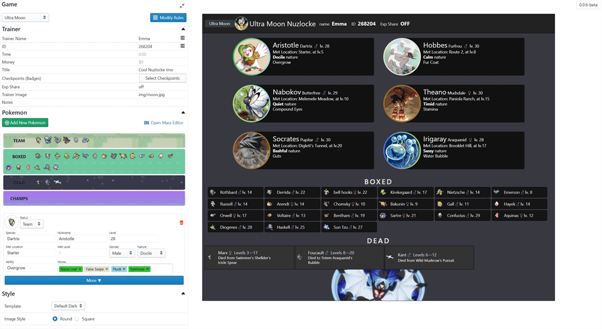

# Nuzlocke Generator ★  

> https://nuzlocke-generator.herokuapp.com/

This is a beta. Expect everything to break. Save backups if you value them.

# Running Locally

```bash
git clone git@github.com:EmmaRamirez/nuzlocke-generator.git
npm install
npm run serve
```

You should find it at `localhost:8080`.

## A Preview



<small>^ That's my current run</small>

## Features
- Record your nuzlocke with a flashy image
- Save data on each of your Pokemon
- Mass Editing, aka spreadsheet mode

If you have ideas for features of fixes, please tell me! I want to make this app as useful as possible.


## Roadmap
- Supporting custom games, badges, types, moves, etc
- Space for sharing your custom ruleset
- Importing from this format and potentially save files
- Supporting better theming & customization of styles
- Allowing sharing & screenshotting without Paint
- Fixing one million bugs

## Hall of Fame

None yet.

## Legal

I don't own Pokemon or any of the images except those of the app itself. All rights belong to their respective parties, including The Pokemon Company International and Nintendo. This application itself independent of copyrighted content is licensed under MIT.