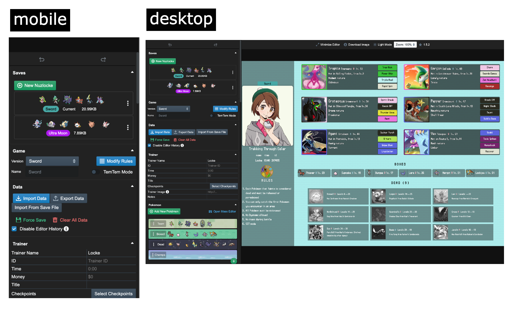

# [Nuzlocke Generator](https://nuzlocke-generator.com/) ·     

https://nuzlocke-generator.com/

## A Preview



## Running Locally

In order to run this application locally, you'll need [NodeJS](https://nodejs.org/en/) and [Git](https://git-scm.com/). After installing those, start by opening the command prompt and running the following commands:

```bash
git clone git@github.com:EmmaRamirez/nuzlocke-generator.git
cd nuzlocke-generator
npm install
npm run serve
```

Note: closing the command prompt will stop the server!

You can also click the `Clone or Download` button and select to download it as a zip file. You'll then want to use the `cd` command to navigate to the nuzlocke-generator folder. I'm available on Discord (emma#4085) or through Github issues if you have any questions.

You should find it at `localhost:8080`. In order to check for updates, run the following

```bash
git pull origin master
```

And then re-run the server!

## Accessing Beta/In-Progress Features

> ⚠️ Proceed at your own risk! These features can be unstable and possibly corrupt your data.

First, create a `.env` file at the root. The following are the current in-use environment variables:

```bash
# Determines if the build uses the faster production build or not
NODE_ENV=<'development' OR 'production'>
# Requires a Rollbar account, logs errors
ROLLBAR_ACCESS_TOKEN=<TOKEN>
ROLLBAR_ENDPOINT=https://api.rollbar.com/api/1/item/
# Used for Bug Reporter
GH_ACCESS_TOKEN=<GH_TOKEN>
# Used for future Theme Editor
THEME_EDITING=true
# Used for future Tem Tem support
TEM_TEM_SUPPORT=true
# Lists out new hotkeys
NEW_HOTKEYS=true
# Used for future HoF feature
HALL_OF_FAME=true
# Used for refactored Results view (still very unstable)
RESULT_V2=true
# Used for future data-freeze feature
LOCKS=true
# Used for planned Gen II saves support
GEN2_SAVES=true
# Used for image uploads
IMAGE_UPLOADS=true
# Legacy, tcg images are now enabled by default
TCG_IMAGES=true
```

## Features
- Record your nuzlocke with a flashy image
- Save data on each of your Pokémon as a `json` file
- Flexible style editing for multiple scenarios
- Custom moves, rulesets, badges, types, and more!
- Import from your actual save files!

If you have ideas for features of fixes, please tell me! I want to make this app as useful as possible.

## Legal

I don't own Pokemon or any of the images except those of the app itself. All rights belong to their respective parties, including The Pokemon Company International and Nintendo. This application itself independent of copyrighted content is licensed under MIT.
